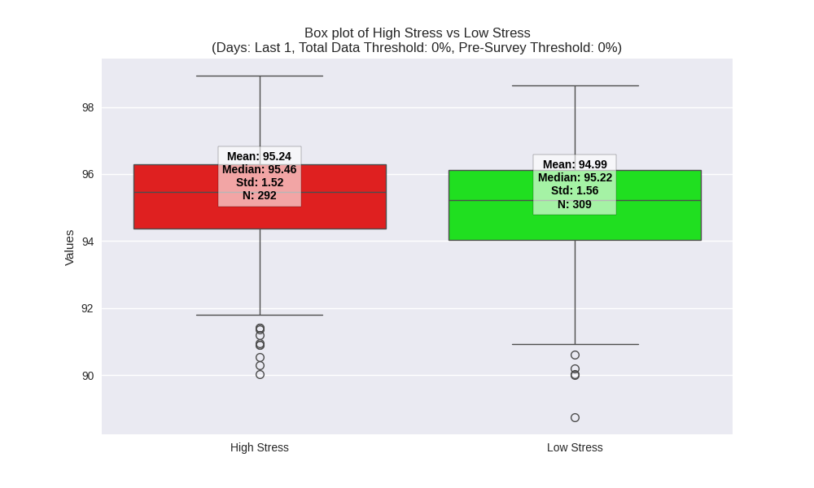
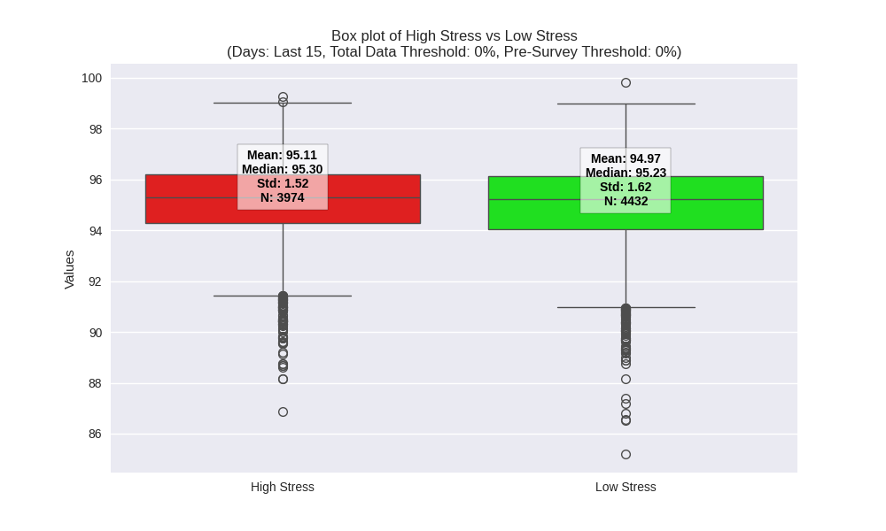
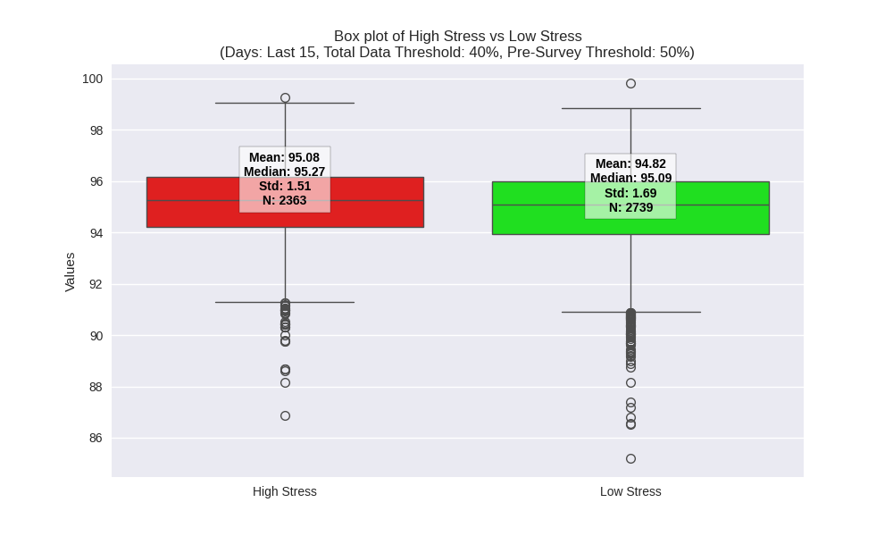
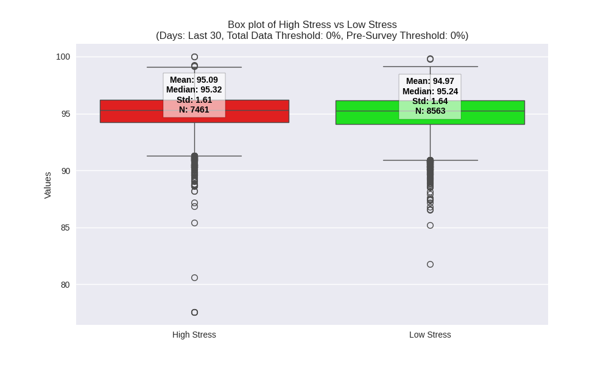
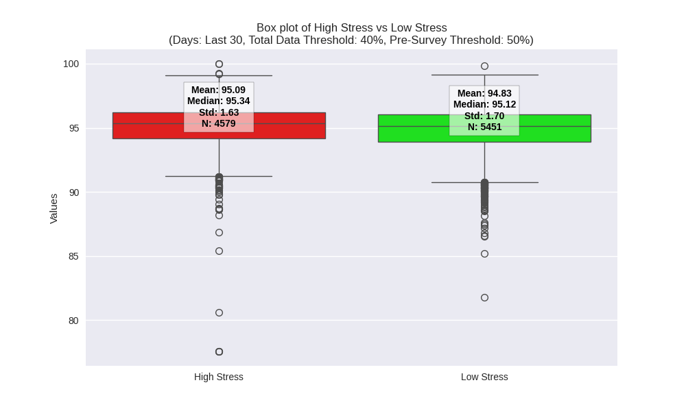
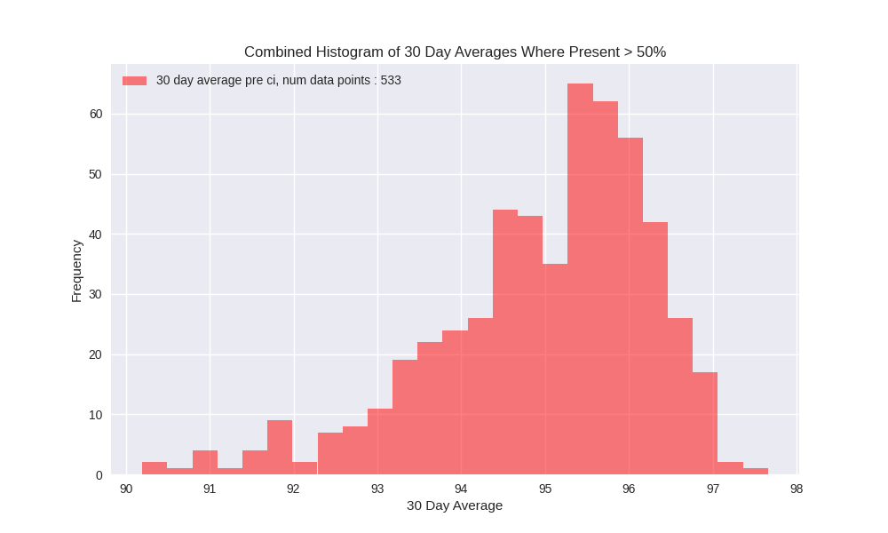
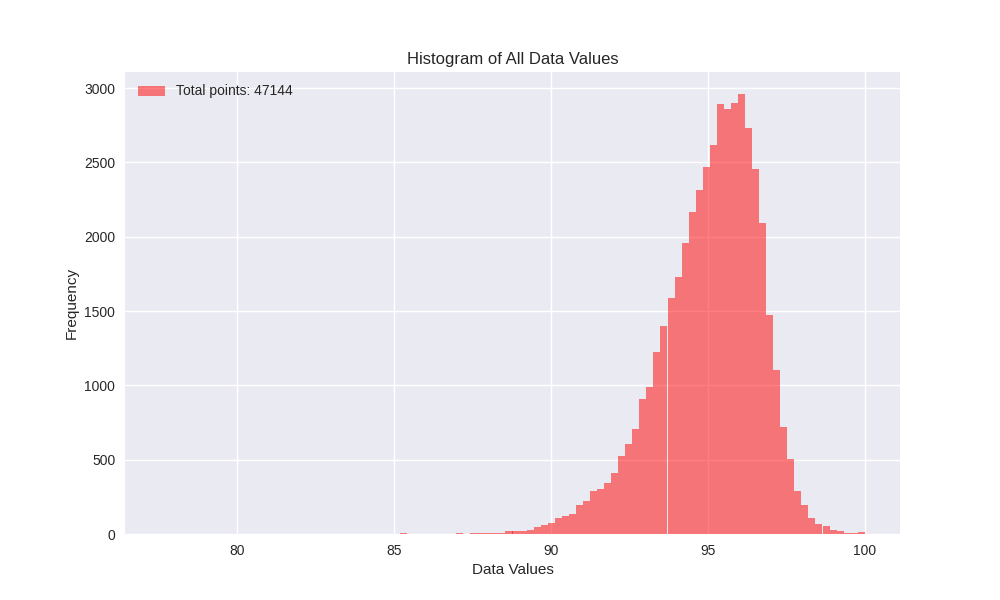
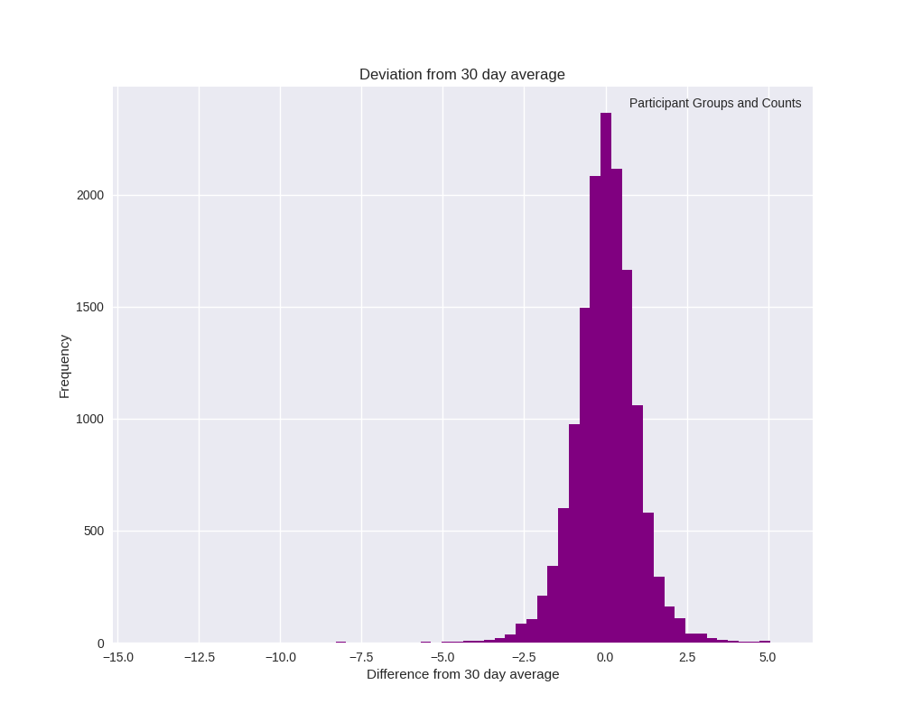
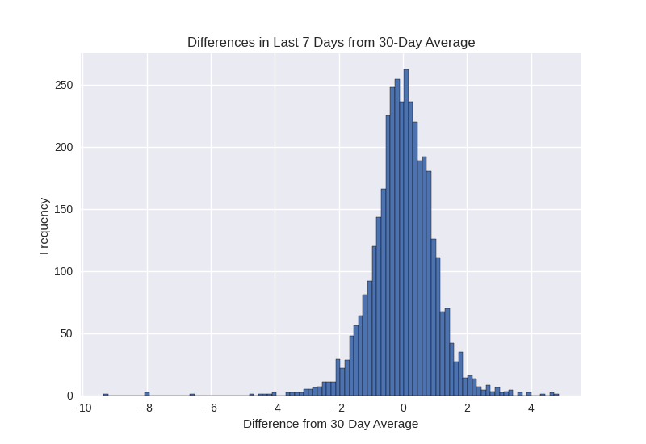
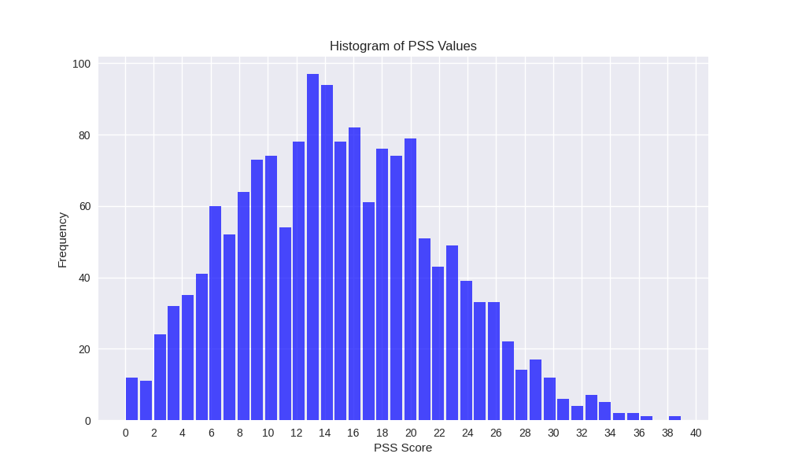

# Spo2-Mental-Health-Prediction
Over the past year, I have been part of Stanford's Snyder Lab aiding in their pursuit to predict mental health states via wearable technology. Using 718 participants, wearable data, and robust survey questionnaires, we have been using machine learning to predict a patients mental health state at a given point. Here is a small portion of my work where I have used machine learning models to deeply analyze the relationship between a mental health signal and a wearable device signal. I have primarily worked with SpO2 and Stress. This code can be generalized to all wearable signals and all mental health signals. 
## Methods
- Machine Learning
- Data preprocessing and cleaning
- Feature engineering 
- Linear Regression Models
- Binary Classification Models
## Setup
1. Clone the repository:
    ```sh
    https://github.com/nick-allen21/Spo2-Mental-Health-Prediction.git
    ```
2. Load the repository into code editor of your choice (recommend VS code)

3. Download the requirements script
    ```sh
    pip3 install -r requirements.txt
    ```
4. Edit the data paths to process your data. Ensure your starting CSVs are in the correct form


# Graphs

## 1 Day Before Survey



## 10 Days Before Survey


## 15 Days Before Survey



## 30 Days Before Survey



## Histogram



# Correlation Graphs


## Difference Histograms



